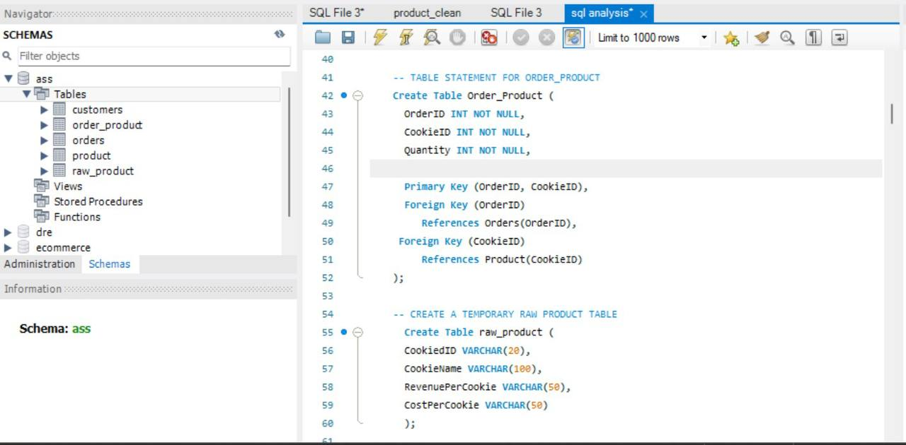
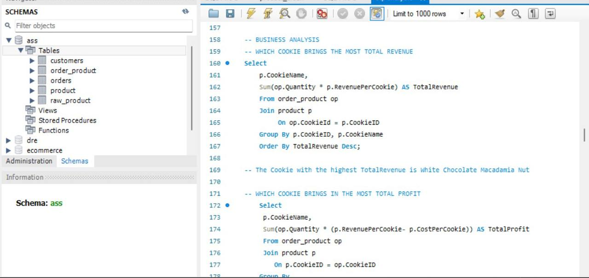
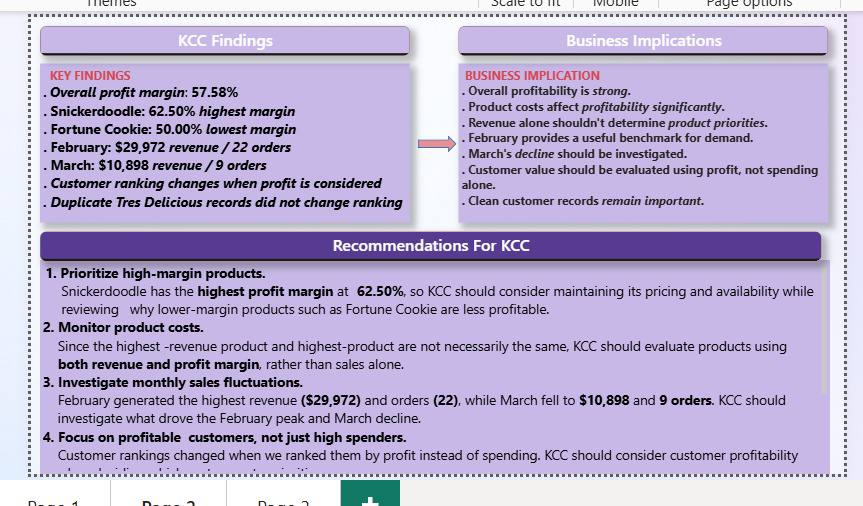

# Kelly's Cookie Company — SQL Database & Analysis

## Overview
An end-to-end data project covering relational database design, SQL analysis, and visual reporting. Multiple raw datasets covering customers, orders, products, and order-product information were structured into a relational MySQL database, then queried to answer core business questions around product performance and customer spending. Findings were visualised in Power BI.

The biggest lesson from this project: data analysis doesn't start with writing queries. It starts with understanding the data.

## The problem
The business had transactional data spread across separate files with no defined relationships between them. There was no single source of truth for answering basic commercial questions: which products were most profitable, which customers spent the most, and how sales trended over time.

## Database Design

Established the core relational structure:

Customers → Orders → Order_Product → Product

- Identified primary keys and foreign keys across four tables
- Defined appropriate data types for each field
- Built the order_product junction table to connect orders to the products purchased
- Documented a key insight: repeated IDs in transactional data are not duplicates — they represent multiple line items within the same order

## What I did

- Designed and built the database schema from scratch in MySQL
- Wrote SQL queries using joins, aggregations, GROUP BY, and calculated fields to answer business questions
- Created reusable SQL views for product performance, customer summaries, and monthly sales
- Connected MySQL to Power BI to build visual reports and an interactive dashboard

## Business questions answered

- Which cookie generated the highest total profit?
- Which generated the highest total revenue?
- Which cookie had the highest quantity sold?
- How did products compare across revenue, cost, quantity, and profit?
- Which customers generated the most spending?
- Which customers placed the most orders, and what was their average order value?

## What I found

- Overall profit margin sits at 57.58% across 50 orders, giving a baseline for how much of each sale converts to profit.
- Snickerdoodle leads on profit margin at 62.50%, while Fortune Cookie trails at 50.00%. The highest-margin product is not the same as the highest-revenue product.
- White Chocolate Macadamia Nut generated the highest total revenue, but not the highest profit — showing that revenue alone should not determine product priorities.
- February was the strongest month at $29,972 across 22 orders, while March fell to $10,898 across 9 orders — a decline worth investigating further.
- Customer rankings changed when profit was considered instead of spending, meaning a "top customer" list based on revenue would identify the wrong accounts.
- Duplicate Tres Delicious records were identified and confirmed not to affect customer rankings, after checking whether they altered the results.

## Business recommendations

1. Prioritise high-margin products. Snickerdoodle has the highest profit margin at 62.50%, so pricing and availability should be maintained while lower-margin products are reviewed.
2. Monitor product costs. Since the highest-revenue product and highest-profit product differ, KCC should evaluate products using both revenue and profit margin rather than sales alone.
3. Investigate monthly sales fluctuations. The gap between February and March performance suggests a demand or data issue that needs review.
4. Focus on profitable customers, not just high spenders. Rankings shift when profit is used as the measure, so customer profitability should guide retention decisions.

## Dashboard preview

## Tools used
MySQL | SQL (Joins, Aggregations, GROUP BY, Views) | Power BI

## Files in this repo
- kcc_analysis.sql — all SQL queries and view definitions
- kcc_dashboard.
pbix — the Power BI report
- 01-schema-design.jpg — database structure
- 02-sql-revenue-query.jpg — SQL analysis
- 03-findings-and-recommendations.jpg — insights and recommendations
- 04-dashboard.jpg — Power BI dashboard

## Contact
📧 Dreyoyebola@gmail.com | 🔗 [LinkedIn](https://linkedin.com/in/oyebola-boluwatife)
